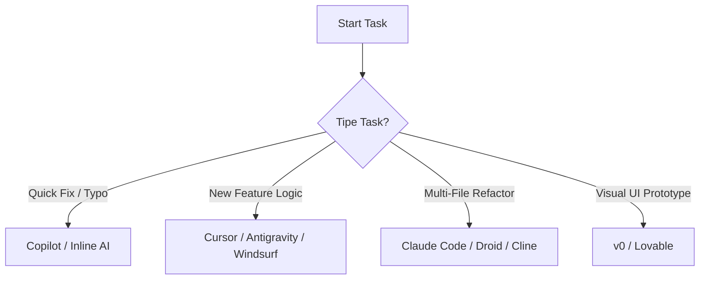

# 🚀 Best Practice Coding with AI (2026): The Ultimate Guide

> **Persona Navigation:**
>
> - 🟢 **Beginner**: Fokus pada tag `[SAFETY]` dan `[STEP-BY-STEP]`. Prioritaskan *Safety First* dan *Verification*.
> - 🟡 **Intermediate**: Fokus pada tag `[EFFICIENCY]`. Gunakan *Context Management* dan *Rules* untuk speed.
> - 🔴 **Expert**: Fokus pada tag `[SCALABILITY]` dan `[AGENTIC]`. Implementasi *Multi-Agent* dan *Custom MCP*.

Panduan komprehensif untuk membangun software skala enterprise dengan AI-native workflows. Divalidasi oleh riset 2025-2026 (METR, MASAI) dan praktik industri.

---

## 📜 The AI-Human Collaboration Contract

Sebelum mengetik satu prompt pun, Anda (Human) dan AI (Assistant) terikat kontrak ini.

| Tanggung Jawab | 🧑 **Human Lead** (Anda) | 🤖 **AI Junior Assistant** |
| :--- | :--- | :--- |
| **Creativity** | Menentukan *Goal*, *Constraints*, dan *Taste*. | Memberikan opsi implementasi, brainstorming ide. |
| **Logic & Arch** | Final decision maker. Menolak solusi buruk. | Mengusulkan pola, refactoring, dan struktur. |
| **Verification** | **WAJIB** memverifikasi keamanan dan logika. | Menjalankan tes otomatis, linter, dan scanning. |
| **Liability** | Bertanggung jawab penuh atas code di Production. | Tidak memiliki tanggung jawab hukum/moral. |

> **⚠️ RULE #1:** Jangan pernah commit kode yang tidak Anda mengerti cara kerjanya.
> **⚠️ RULE #2:** AI bisa *hallucinate* paket, fungsi, dan sintaks. *Trust, but Verify.*

---

## 🔵 PHASE 0: SETUP & TOOLING LANDSCAPE

**Objective:** Memilih senjata yang tepat untuk medan perang yang benar.

### 0.1 The Tooling Landscape (2026)

Tidak ada "Best Tool" mutlak. Pilih berdasarkan kebutuhan spesifik Anda.

| Kategori | Tools Utama | Best For | Cost |
| :--- | :--- | :--- | :--- |
| **Integrated IDE** | **Cursor**, **Windsurf**, **Antigravity** | *All-rounder*. Coding harian, refactoring, context-aware chat. | $$ - $$$ |
| **Native Extensions**| **GitHub Copilot**, **Blackbox** | *Autocomplete*. Kecepatan mengetik, boilerplate rendah. | $ - $$ |
| **Autonomous Agents**| **Claude Code**, **Droid**, **Cline** (Open Source) | *Task Execution*. Menjalankan terminal commands, multi-file edits. | Free - $$$ |
| **Specialized** | **v0** (UI/UX), **Lovable** (Full Stack) | *Vibe Coding*. Prototype cepat visual-first. | Free - $$$ |

### 0.2 Matrix Keputusan: Kapan Pakai Apa?



### 0.3 Cost vs Result Analysis

| Metode | Biaya Token | Kecepatan Dev | Kualitas Code | Risiko |
| :--- | :--- | :--- | :--- | :--- |
| **Zero-Shot Prompt** | Rendah | Tinggi | Rendah (Generic) | Tinggi (Hallucination) |
| **Context-Aware Chat** | Sedang | Sedang | Sedang (Contextual) | Sedang |
| **Agentic Loop** | Tinggi 💸 | Tinggi | Tinggi (Self-Correcting) | Rendah (Jika diawasi) |

> **💡 [BEGINNER TIP]**: Mulai dengan IDE gratisan (misal Antigravity/Windsurf tier free) + Model Flash/Mini untuk belajar. Jangan langsung langganan tools $50/mo sebelum paham workflow.

---

## 🟡 PHASE 1: DISCOVERY & CONTEXT

**Objective:** Jangan biarkan AI "menebak". Suapi dengan konteks yang kaya dan terstruktur.

### 1.1 Context Pruning Strategy [EFFICIENCY]

AI Context Window itu mahal dan bisa "mabuk" jika terlalu penuh.

**Teknik Pruning:**

1. **Map**: Gunakan tool seperti `repomix` atau `files-to-prompt` untuk generate struktur project.
2. **Filter**: Buang folder `node_modules`, `dist`, `.git`, lockfiles, dan asset binary.
3. **Focus**: Hanya masukkan file yang *relevan secara langsung* dengan fitur yang sedang dikerjakan.
4. **Summary**: Untuk file pendukung (misal `utils.ts`), cukup berikan interface/signature-nya saja, tidak perlu implementasi penuh.

### 1.2 SOP: Cheat Sheet Prompt (Discovery)

Copy-paste ini untuk memulai fitur baru.

```markdown
# FEATURE DISCOVERY PROMPT
Role: Senior Technical Architect & Product Manager.
Task: Analyze the request for [NAMA_FITUR].

Context:
- Project Tech Stack: [Next.js/Laravel/etc]
- Existing Architecture: [Monolith/Microservices]
- Constraint: [Performance/Security/Budget]

Steps:
1. Identify **User Needs** (Jobs to be Done).
2. Outline **Technical Requirements** (API, DB Schema, UI Components).
3. List potential **Risks/Edge Cases** (Security, Scalability).
4. Propose 2 Implementation Options (Safe vs Performant).

Output: Markdown format standard.
```

---

## 🟠 PHASE 2 & 3: DOCUMENTATION & DESIGN

**Objective:** Blueprint sebelum peletakan batu pertama.

### 2.1 The "Living" Documentation

Jangan buat dokumen mati. Buat dokumen yang bisa dibaca AI (`.md` files di root project).

- `product_requirements.md` (PRD)
- `tech_spec.md` (Database, API Contract)
- `active_context.md` (Scratchpad untuk status terkini)

### 2.2 SOP: Architecture Validation Prompt

```markdown
# ARCHITECTURE REVIEW PROMPT
Role: Staff Principle Engineer.
Task: Review the proposed diagram/schema for [NAMA_FITUR].

Input:
[Paste Schema/Diagram Code here]

Checklist:
- [ ] Circular Dependencies?
- [ ] Scalability Bottlenecks (N+1 queries)?
- [ ] Security Vulnerabilities (IDOR, Injection)?
- [ ] Consistency with existing codebase?

Output: "Approved" or "Request Changes" with specific fixes.
```

---

## 🔴 PHASE 4: DEVELOPMENT (TEST-DRIVEN AI)

**Objective:** Code yang *works*, bukan hanya code yang *looks like it works*.

### 4.1 🛡️ Protocol: Test-Driven AI Development [SAFETY]

**DILARANG** meminta AI menulis kode fitur sebelum tes dibuat.

1. **Write Test**: Minta AI buat tes (Unit/Feature Test) yang *failing* berdasarkan PRD.
2. **Verify Failure**: Jalankan tes, pastikan merah (gagal). Ini memvalidasi bahwa tes mendeteksi ketiadaan fitur.
3. **Write Code**: Minta AI implementasi fitur *hanya* untuk membuat tes tersebut hijau (passing).
4. **Refactor**: Minta AI merapikan kode (clean code) tanpa merusak tes.

### 4.2 SOP: TDD Prompt Template

```markdown
# TDD IMPLEMENTATION PROMPT
Mode: Strict TDD.

Step 1: Create a generic test file for [Feature Name].
- Define the positive case (Happy Path).
- Define 2-3 negative cases (Edge cases, invalid input).
- Assert expected outcomes clearly.
- DO NOT implement the feature yet.

Wait for my confirmation that tests are FAILING correctly.
```

### 4.3 Vibe Coding Risk Mitigation

Paper ArXiv 2025 menemukan 970+ celah keamanan di aplikasi "Vibe Coded".
**Mitigasi:**

- Selalu sanitasi input user.
- Gunakan `.cursorrules` atau `.clinerules` untuk enforce security standard (e.g., "Always use prepared statements").
- Jangan pernah hardcode API Key.

---

## 🧪 PHASE 5: VERIFICATION & DEBUGGING

**Objective:** Trust no one. Test everything.

### 5.1 Verification Checklist

- [ ] **Automated Tests**: Pass?
- [ ] **Linter/Static Analysis**: Clean?
- [ ] **Security Scan**: (`npm audit`, etc) Clean?
- [ ] **Visual Check**: UI sesuai design? (Gunakan Vision model untuk review screenshot).

### 5.2 SOP: Bug Fix Protocol

```markdown
# BUG FIX PROMPT
Context:
- Error Message: [Paste Error]
- Relevant Code: [Paste Code Snippet]
- Steps to Reproduce: [List Steps]

Task:
1. Explain WHY the error happened (Root Cause Analysis).
2. Propose a fix that does NOT break other features.
3. Verify the fix logic step-by-step.

Output: Patch/Diff format.
```

---

## 🔄 PHASE 6-7: CONTEXT OPTIMIZATION & TROUBLESHOOTING

**Objective:** Maintain velocity jangka panjang.

### 6.1 Troubleshooting Common 2026 AI Errors

| Error Symptom | Root Cause Possible | Solution |
| :--- | :--- | :--- |
| **Looping Code** | Context window penuh atau instruksi ambigu. | Reset sesi. Gunakan "Context Pruning". Perjelas instruksi langkah terakhir. |
| **Hallucination** (Library ga ada) | Model cutoff date atau training data bias. | Gunakan **MCP Tools** (e.g., Context7) untuk cek docs terbaru. Verify di npm/pypi. |
| **Lazy Coding** (// ...rest of code) | Token limit output atau model malas. | Prompt: "Please complete the code fully, do not use placeholders." atau minta per bagian. |
| **Regression** (Fitur A rusak karena B) | Context loss tentang fitur A. | Implementasi TDD (Phase 4). Pastikan tes fitur A jalan sebelum fitur B di-merge. |
| **Circular Dependency** | Desain arsitektur buruk dari awal. | Minta AI: "Analyze dependency graph and refactor to decouple modules." |

### 6.2 Context Management Cheat Sheet [SCALABILITY]

- **Reset**: Setiap selesai 1 fitur besar, *archive* chat session, mulai baru.
- **Update Docs**: Mutakhirkan `active_context.md` sebelum reset, lalu feed ke sesi baru.
- **Roleplay**: Selalu ingatkan role AI di awal sesi baru ("You are the Lead Dev for X...").

---

## 📚 Resources & Next Steps

- **Workflow Visualization**: [Lihat Diagram Alur](workflow-visualization/docs/logic_flow.md)
- **MCP Servers**: Setup Context7, Firecrawl, dan Exa untuk supercharge IDE Anda.
- **Community**: Bergabung dengan komunitas Vibe Coding untuk update prompt terbaru.

> **Final Note:** AI adalah *multiplier*. 0 x 100 = 0. 1 x 100 = 100. Kualitas Anda sebagai engineer menentukan hasil akhirnya.

---
**Version**: 2026.1.0 | **Last Updated**: Jan 2026
