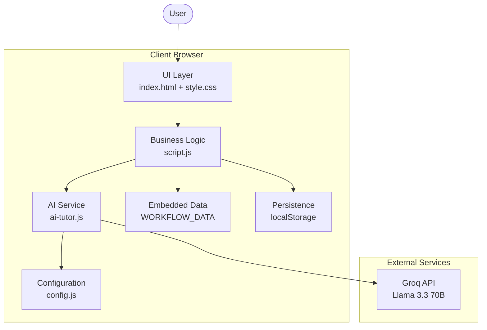
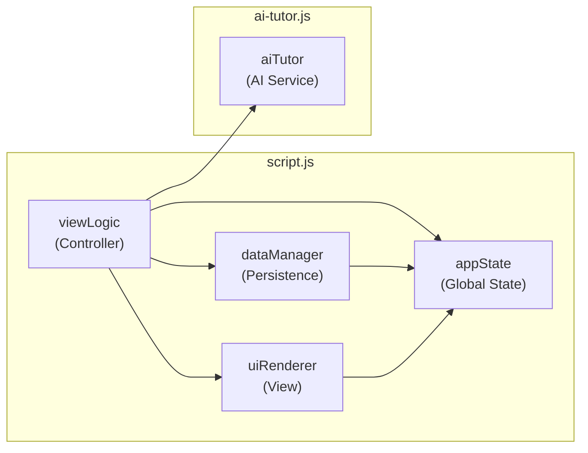
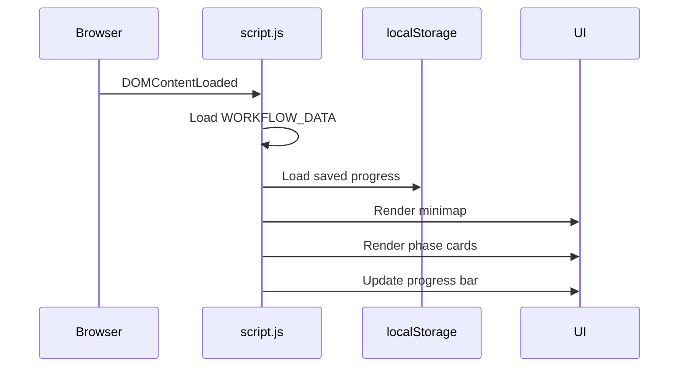
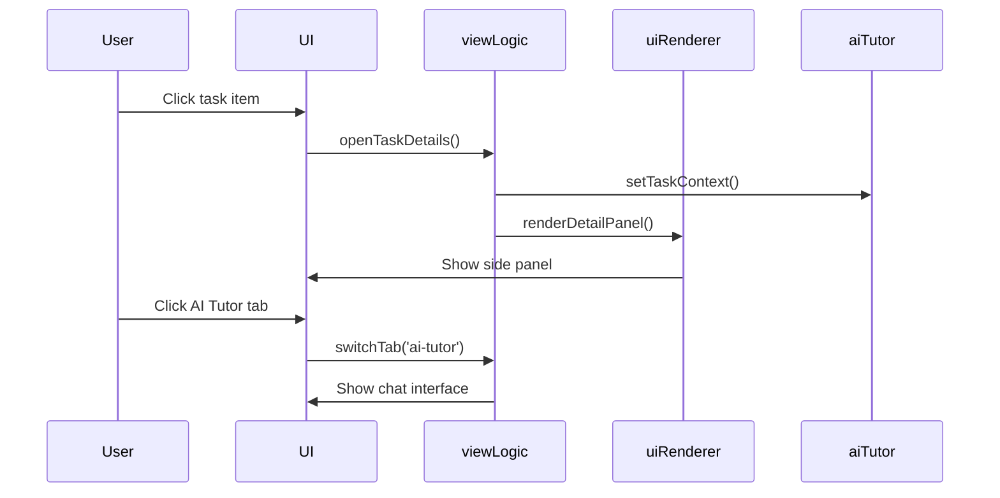
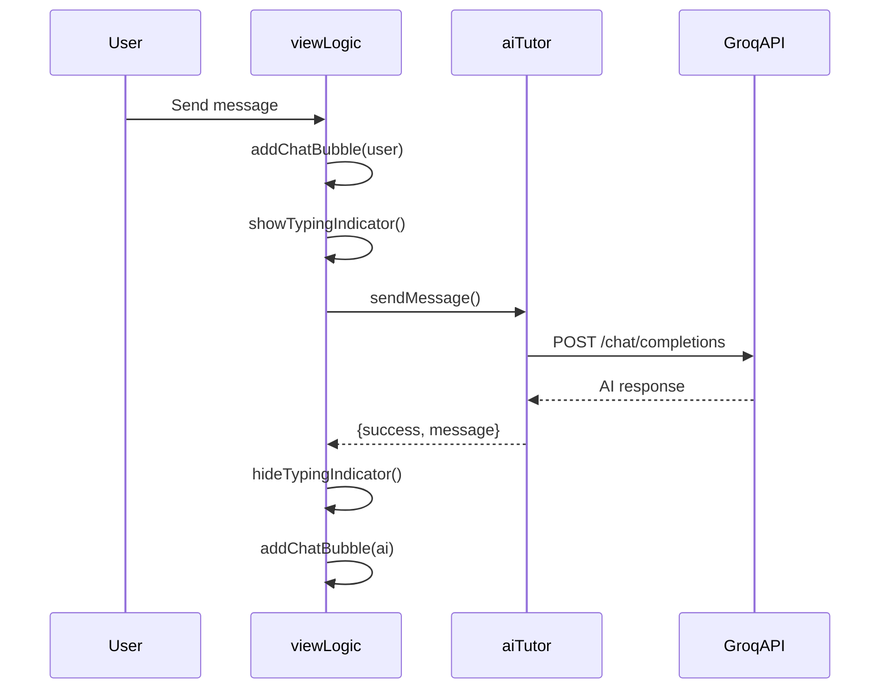
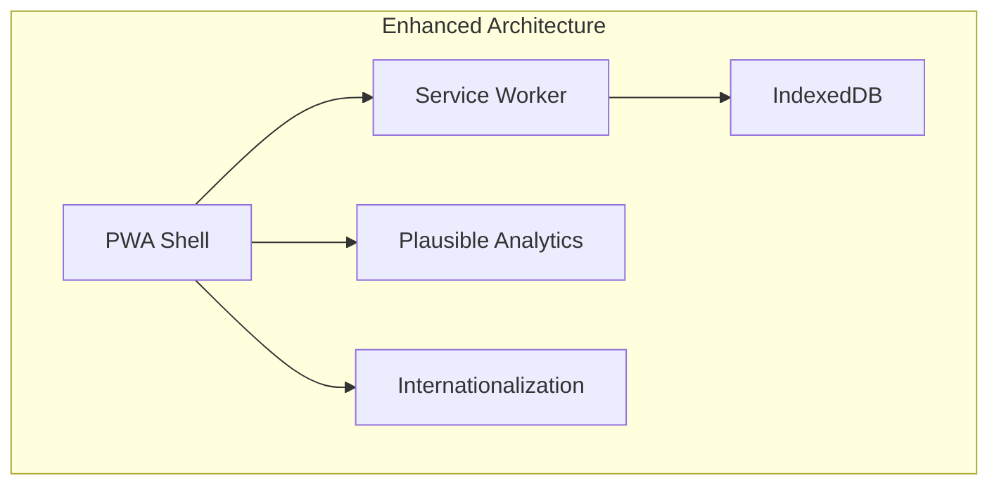

# System Architecture (v2.0)

## Focus-Tracker Workflow Visualization

**Status**: Production  
**Type**: Client-Side SPA + AI Integration

---

## High-Level Architecture



---

## Component Architecture



---

## File Structure

```
workflow-visualization/
├── index.html          # Entry point & DOM structure
├── style.css           # Design tokens & components (1200+ lines)
├── script.js           # Core logic (750+ lines)
│   ├── WORKFLOW_DATA   # Embedded JSON (47 tasks)
│   ├── appState        # Runtime state
│   ├── dataManager     # localStorage CRUD
│   ├── uiRenderer      # DOM rendering
│   └── viewLogic       # Event handlers & business logic
├── config.js           # API keys & settings
├── ai-tutor.js         # Groq API integration
├── /data
│   └── workflow.json   # (Legacy, now embedded)
└── /docs
    ├── prd.md
    ├── architecture.md
    ├── frontend.md
    ├── logic_flow.md
    └── data_schema.md
```

---

## Data Flow

### 1. Application Initialization



### 2. Task Interaction Flow



### 3. AI Chat Flow



---

## State Management

### Runtime State Object

```javascript
const appState = {
    activePhaseId: 0,       // Current expanded phase
    isOverviewMode: false,  // Focus vs Overview toggle
    searchQuery: "",        // Active search filter
    progress: {},           // { "p0-t1": true, ... }
    taskStatus: {},         // { "p0-t1": "done", ... }
    data: null              // Loaded WORKFLOW_DATA
};
```

### AI Tutor State

```javascript
const aiTutor = {
    systemPrompt: "...",      // Tutor personality
    chatHistory: [],          // Conversation context
    currentTaskContext: null  // Active task info
};
```

### Persistence Strategy

| Data | Storage | Trigger |
|------|---------|---------|
| Task progress | localStorage | On checkbox change |
| Active phase | localStorage | On phase navigation |
| Chat history | Memory only | Per session |
| API key | config.js | Static |

---

## Module Responsibilities

| Module | Responsibility |
|--------|----------------|
| **appState** | Single source of truth for UI state |
| **dataManager** | localStorage read/write, export/import |
| **uiRenderer** | DOM manipulation, template rendering |
| **viewLogic** | Event handling, business logic, AI integration |
| **aiTutor** | Groq API communication, context management |

---

## Security Considerations

| Concern | Mitigation |
|---------|------------|
| XSS | Use `.textContent` for user input, sanitize markdown |
| API Key Exposure | `config.js` excluded from git, client-side only |
| CORS | Groq API allows browser requests |
| Data Loss | Export/import JSON backup feature |

---

## Performance Optimizations

| Technique | Implementation |
|-----------|----------------|
| Embedded data | No fetch() latency, file:// compatible |
| CSS containment | Scoped repaints on filter |
| Debounced search | 300ms input delay |
| Lazy rendering | Only active phase expanded |
| Smooth animations | CSS transforms, will-change |

---

## Future Architecture (v3.0)



| Feature | Priority | Status |
|---------|----------|--------|
| PWA offline support | High | Planned |
| IndexedDB fallback | Medium | Planned |
| Multi-language | Low | Backlog |
| Usage analytics | Low | Backlog |
