# System Flow & Logic Design (v2.0)

## Focus-Tracker Workflow Visualization

**Status**: Production  
**Reference**: [architecture.md](./architecture.md), [prd.md](./prd.md)

---

## Application Lifecycle

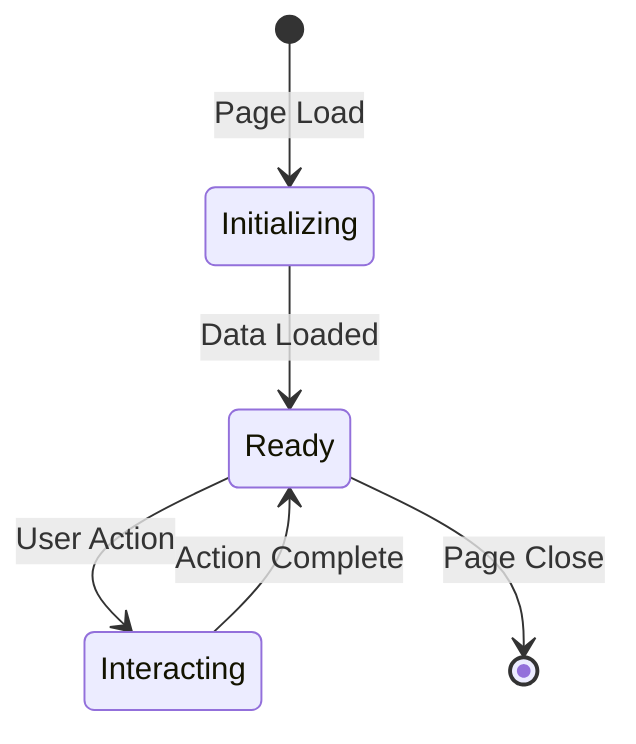

---

## Core User Flows

### 1. First-Time User Flow

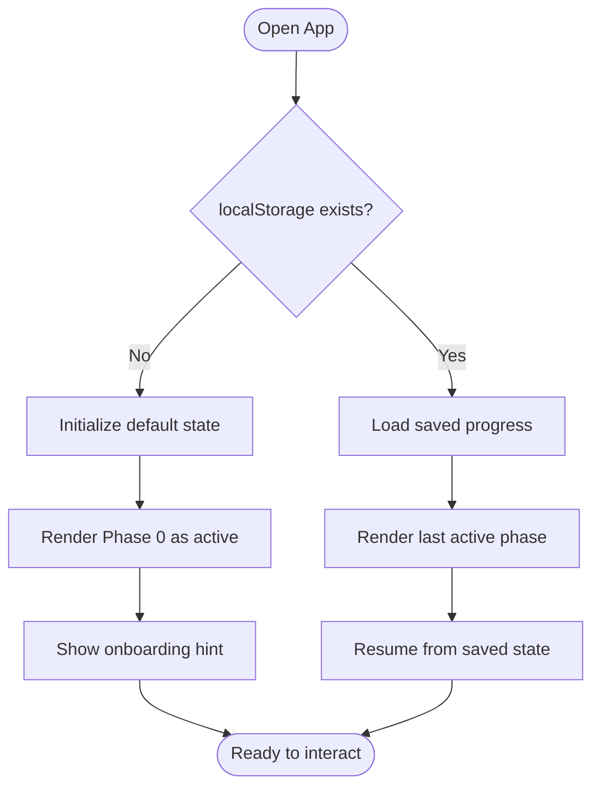

### 2. Task Learning Flow

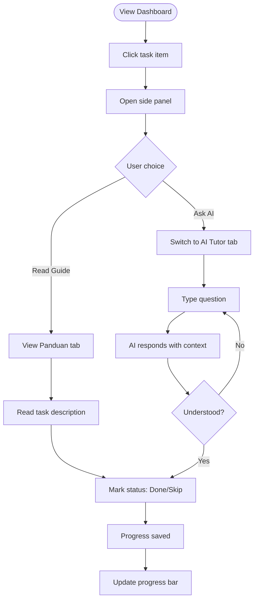

### 3. Search & Navigation Flow

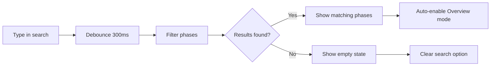

---

## Feature Logic Details

### Focus Mode Toggle

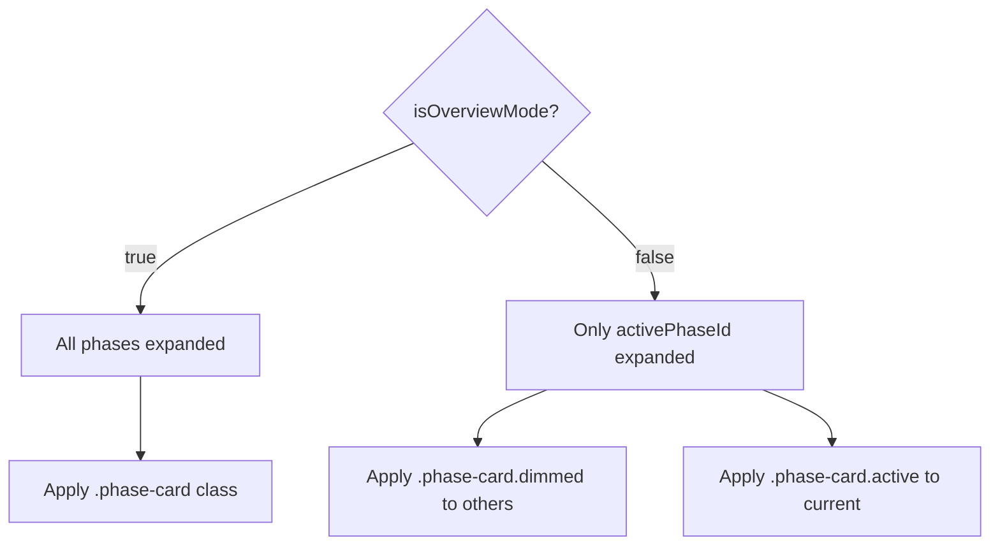

**State Transitions:**

| Trigger | From | To |
|---------|------|-----|
| Click "Overview" | Focus | Overview |
| Click dimmed card | Focus | Focus (new active) |
| Search input | Any | Overview |
| Clear search | Overview | Focus |

### Task Status Management

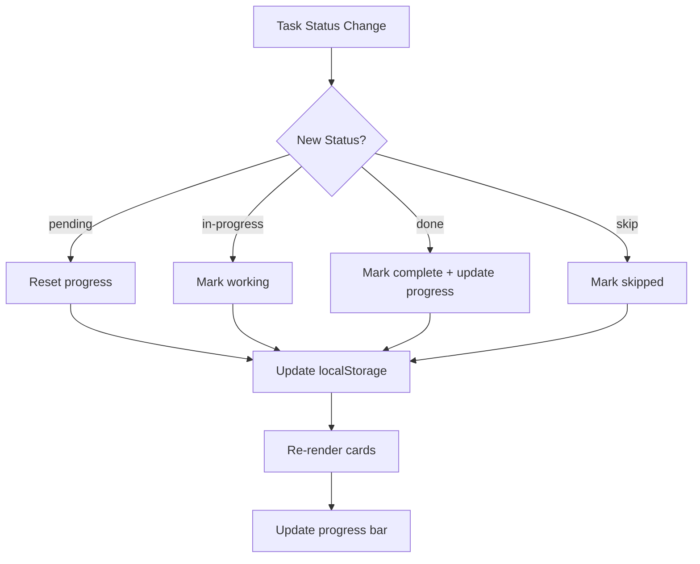

**Status Icons:**

| Status | Icon | Visual |
|--------|------|--------|
| pending | ○ | Default gray |
| in-progress | ◐ | Yellow/amber |
| done | ● | Green + strikethrough |
| skip | ⊘ | Red + dimmed |

### AI Tutor Context Flow

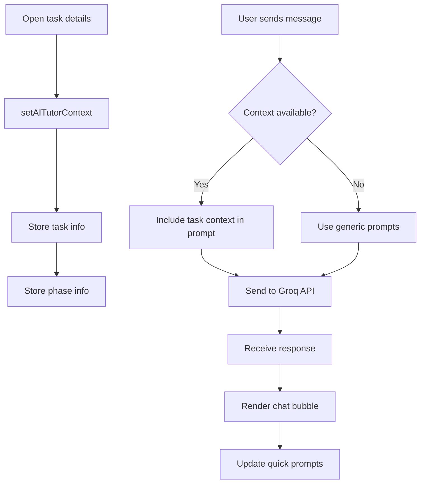

**Context Object:**

```javascript
{
    taskId: "p0-t1",
    taskLabel: "Pilih & Install IDE AI",
    taskDescription: "**Apa itu?** IDE AI adalah...",
    phaseTitle: "1. Persiapan Alat Tempur"
}
```

---

## State Transitions

### Application State Machine

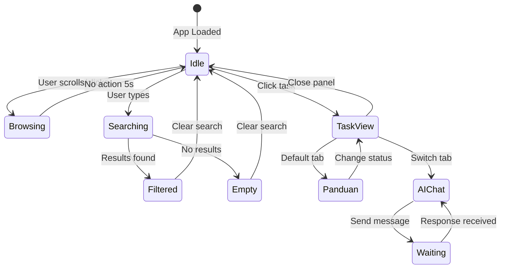

---

## Error Handling

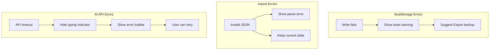

| Error Type | User Message | Recovery |
|------------|--------------|----------|
| localStorage full | "Storage penuh. Export data." | Use Export feature |
| Invalid import | "File tidak valid." | Retry with correct file |
| API timeout | "❌ Error: timeout" | Retry message |
| Network error | "❌ Error: network" | Check connection |

---

## Performance Considerations

### Rendering Optimization

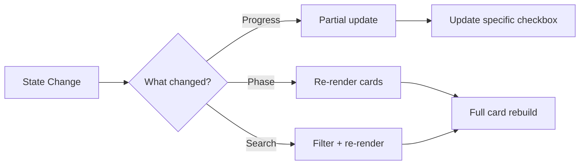

### Debounce Strategy

| Event | Debounce | Reason |
|-------|----------|--------|
| Search input | 300ms | Reduce filter calls |
| localStorage write | 0ms | Immediate persist |
| Scroll | N/A | Native browser |

---

## Module Communication

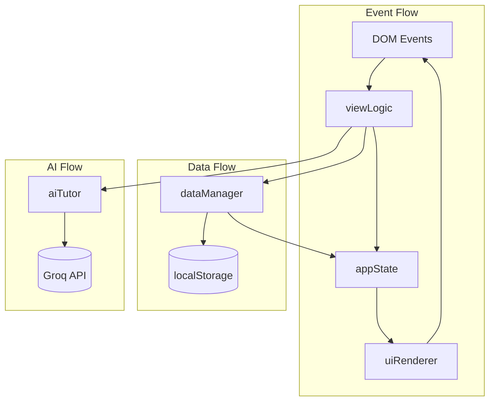
